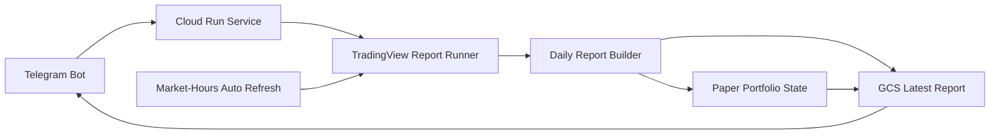

# EGX Smart Trading Coach

A **paper-trading / advisory** Python system for the Egyptian Stock Exchange (EGX). It scans the market, builds daily reports, and delivers them through a Telegram bot on Google Cloud Run. All trades are simulated — there is **no** broker connection, **no** Thndr integration, and **no** real buy/sell execution.

**Telegram bot:** [@Samyah_bakako_bot](https://t.me/Samyah_bakako_bot)

---

## Project Overview

EGX Smart Trading Coach helps review EGX opportunities in Egyptian Arabic through Telegram. The production workflow is **Telegram-first**:

| Layer | Role |
|-------|------|
| **Telegram bot** | Main user interface — menus, report sections, manual refresh |
| **Google Cloud Run** | Runs the bot process and on-demand / scheduled report generation |
| **TradingView Screener** | Primary market data provider for Cloud reports (`tradingview-screener`) |
| **Daily report builder** | Scanner A, Strategy Scanner B, filters, ranking, mood, fundamentals, timing |
| **Google Cloud Storage** | Persistent latest report + paper portfolio state across container restarts |
| **Paper portfolio** | Virtual cash, positions, and trade journal — advisory simulation only |

Optional local development paths (CSV fixtures, EGX browser readers, Playwright) remain for testing and offline workflows. Cloud production uses **TradingView only** for report data.

---

## Current Architecture



**End-to-end flow:**

1. User interacts with Telegram (or auto-refresh fires during EGX hours).
2. Cloud Run service `egx-smart-trading-coach` handles the request.
3. Report runner executes `python main.py --egx-workflow report --data-provider tradingview …`.
4. Daily report builder produces `.txt` + `.json` with executive summary, candidates, signals, portfolio sections.
5. Latest report uploads to GCS (`reports/latest_report.*`).
6. Telegram buttons read the latest report (GCS first, local container fallback).
7. Paper portfolio / trade journal sync to GCS when present (`storage/*.json`).
8. Auto-refresh worker (optional) re-runs the report on a market-hours schedule.

**TA-Lib** adds extra technical confirmation when installed; if missing (common on slim Docker images), reports continue with a fallback — no crash.

---

## Current Cloud Configuration

| Setting | Value |
|---------|--------|
| **GCP project ID** | `samyah` |
| **GCP project number** | `202577288159` |
| **Cloud Run service** | `egx-smart-trading-coach` |
| **Region** | `europe-west1` |
| **Service URL** | https://egx-smart-trading-coach-202577288159.europe-west1.run.app |
| **GCS bucket** | `samyah-egx-state-202577288159` |
| **Telegram bot** | [@Samyah_bakako_bot](https://t.me/Samyah_bakako_bot) |
| **Container entrypoint** | `python main.py --telegram-bot` |
| **Health check** | HTTP `/` and `/health` on `PORT` (default `8080`) |

See `DEPLOYMENT.md` for additional deployment notes.

---

## Environment Variables and Secrets

Never commit tokens or secrets. In production, **`TELEGRAM_BOT_TOKEN` comes from Secret Manager only** — not plain env vars in git or docs.

| Variable | Value / source | Purpose |
|----------|----------------|---------|
| `TELEGRAM_BOT_TOKEN` | Secret Manager: `telegram-bot-token:latest` | Telegram Bot API authentication |
| `EGX_STATE_GCS_BUCKET` | `samyah-egx-state-202577288159` | Enables GCS persistent state |
| `EGX_AUTO_REFRESH_ENABLED` | `true` | Turn on market-hours auto refresh |
| `EGX_AUTO_REFRESH_INTERVAL_SECONDS` | `180` | Intraday refresh interval (minimum 60) |
| `TELEGRAM_ALLOWED_CHAT_ID` | *(optional)* | Restrict bot to one chat |
| `PORT` | Set by Cloud Run | Health server port |

**Cloud Run secret binding:**

```bash
--set-secrets TELEGRAM_BOT_TOKEN=telegram-bot-token:latest
```

---

## GCS Files

Cloud Run local filesystem is **not reliable for permanent state** — container restarts wipe local files. **GCS is the persistent state layer** when `EGX_STATE_GCS_BUCKET` is set.

| GCS object path | Contents |
|-----------------|----------|
| `reports/latest_report.txt` | Latest daily report (plain text) |
| `reports/latest_report.json` | Latest daily report (JSON for Telegram) |
| `storage/portfolio_state.json` | Paper portfolio (virtual cash, open positions) |
| `storage/trades.json` | Paper trade journal |

**Behavior:**

- Each successful report save writes timestamped files under `data/reports/` locally **and** updates GCS latest objects.
- Telegram loads GCS first, then falls back to the newest local file.
- Portfolio/journal hydrate from GCS when local files are missing after a restart.
- Without `EGX_STATE_GCS_BUCKET`, development uses filesystem-only state under `storage/` and `data/reports/`.

---

## Telegram Features

The bot is **advisory only**. Every flow includes a paper-trading disclaimer.

| Button | Purpose |
|--------|---------|
| 📊 تقرير النهارده | Quick overview from the latest saved report |
| 🔄 حدّث التقرير دلوقتي | Manual report refresh (same Cloud Run report command) |
| 🔥 الفرص | Opportunities submenu — best picks, top 3, next session |
| 🚨 البيع والمحفظة | Sell review + portfolio submenu |
| 📈 السوق | Market submenu — status, hot sectors, ultra-short summary |
| 🧠 ليه السهم ده؟ | WHY flow for a specific symbol |
| ⚠️ التحذيرات | Top warnings from the latest report |
| 💼 محفظتي الورقية | Paper portfolio summary (when GCS/local state exists) |
| 💰 الأرباح والخسائر | Paper P&L summary (when data exists) |
| ℹ️ مساعدة | Help text + disclaimer |

Manual refresh and auto-refresh share the same report runner and in-process lock (no concurrent runs).

---

## Auto Refresh

Runs inside the Telegram bot process when `EGX_AUTO_REFRESH_ENABLED=true`.

| Rule | Behavior |
|------|----------|
| Enabled | Only when `EGX_AUTO_REFRESH_ENABLED=true` |
| Trading days | Sunday–Thursday (Cairo / EGX calendar) |
| Friday / Saturday | No refresh |
| Before 09:30 Cairo | Sleep |
| 09:30–10:00 | Pre-open refresh **once** per day |
| 10:00–14:30 | Intraday refresh every **3 minutes** (default via `EGX_AUTO_REFRESH_INTERVAL_SECONDS=180`) |
| After 14:30 | Post-close refresh **once** per day |
| Overnight | No all-night refresh |
| Overlap | Skips if manual refresh or another run is in progress |
| Failures | Logged safely — no automatic spam to Telegram users |

Manual **🔄 حدّث التقرير دلوقتي** always works regardless of auto-refresh settings.

---

## Important Commands

### Local development (Windows / Git Bash)

**Project directory:**

```bash
cd /f/Loretta/سامياه/EGX_AI_Trading_Bot/egx_smart_trading_coach
```

**Git status:**

```bash
git status
```

**Run tests:**

```bash
python -m pytest -v
```

**Local report (TradingView full market):**

```bash
python main.py --egx-workflow report --data-provider tradingview --scanner-universe full-market --top-candidates 10 --min-score 75
```

**Cloud readiness check:**

```bash
python main.py --egx-cloud-readiness-check
```

**Bootstrap fresh paper portfolio** (one-time on server; does not migrate old PC state):

```bash
python main.py --egx-bootstrap-cloud-paper-portfolio
```

**Force bootstrap** (overwrites existing GCS/local paper state):

```bash
python main.py --egx-bootstrap-cloud-paper-portfolio --force-bootstrap-paper-portfolio
```

**Start Telegram bot locally** (token from Secret Manager — never commit):

```bash
export TELEGRAM_BOT_TOKEN="your-token-from-secret-manager"
python main.py --telegram-bot
```

### Cloud Shell / deployment

**Cloud Shell repo:**

```bash
cd ~/egx-smart-trading-coach
```

**Pull latest code:**

```bash
git pull
```

**Deploy to Cloud Run:**

```bash
gcloud run deploy egx-smart-trading-coach \
  --source . \
  --region europe-west1 \
  --set-secrets TELEGRAM_BOT_TOKEN=telegram-bot-token:latest \
  --set-env-vars EGX_STATE_GCS_BUCKET=samyah-egx-state-202577288159,EGX_AUTO_REFRESH_ENABLED=true,EGX_AUTO_REFRESH_INTERVAL_SECONDS=180 \
  --min-instances 1 \
  --max-instances 1 \
  --no-cpu-throttling
```

**Read Cloud Run logs:**

```bash
gcloud run services logs read egx-smart-trading-coach --region europe-west1 --limit 120
```

**Safe logs with token redaction:**

```bash
gcloud run services logs read egx-smart-trading-coach --region europe-west1 --limit 160 | sed -E 's#bot[0-9]+:[A-Za-z0-9_-]+#bot[REDACTED_TELEGRAM_TOKEN]#g; s#TELEGRAM_BOT_TOKEN=[^ ]+#TELEGRAM_BOT_TOKEN=[REDACTED]#g'
```

**Describe env vars on the running service:**

```bash
gcloud run services describe egx-smart-trading-coach \
  --region europe-west1 \
  --format="value(spec.template.spec.containers[0].env)"
```

**List GCS state (full bucket):**

```bash
gcloud storage ls -r gs://samyah-egx-state-202577288159
```

**List GCS storage (portfolio + journal):**

```bash
gcloud storage ls -r gs://samyah-egx-state-202577288159/storage/
```

**List latest reports in GCS:**

```bash
gcloud storage ls -r gs://samyah-egx-state-202577288159/reports/
```

---

## Patch History

History through **Patch 42**. Bullets note what was added, why it matters, and which surfaces are affected: **Report**, **Paper**, **Telegram**, **Cloud Run**, **GCS**.

### Foundation (Patches 1–17) — brief

| Patch | What changed |
|-------|--------------|
| **1** | Core models, virtual portfolio, risk rules, trade journal — foundation for all paper simulation. **Paper** |
| **3** | CSV market data provider, market snapshot, mood detection — local dev data path. **Report** |
| **4–5** | Scanner A (momentum watchlist) + Strategy Scanner B (entry/stop/target signals). **Report scoring** |
| **6–8** | Auto paper trading, monitor/exits, backtesting — simulated execution only. **Paper** |
| **9–9.10** | EGX data import, public/browser readers, live snapshot scanner — optional local data paths. **Report** |
| **10–11** | Live volume intelligence + daily report V1. **Report** |
| **12–17** | Live paper workflows, snapshot validation, CLI consolidation (`--egx-workflow`). **Report / Paper** |

### Patches 18–23 — TradingView provider and scanner stack

**Patch 18 — Shared paper engine + TradingView provider**

- Introduced `tradingview_data_provider.py` as a first-class data source alongside local CSV/EGX readers.
- Refactored paper engine so live and report workflows share the same portfolio/journal logic.
- **Why:** Cloud production needs a remote screener API; local EGX browser flows are not suitable for Cloud Run.
- **Affects:** Report scoring, Cloud Run data path.

**Patch 19–19.1 — Market quality filters**

- Min price, volume, market cap, P/B gates before candidates enter ranking.
- Report sections show how many symbols passed each filter tier.
- **Why:** Reduces junk symbols and keeps Top Candidates actionable.
- **Affects:** Report scoring only.

**Patch 20–20.1 — Candidate ranking**

- Composite ranking score from momentum, volume, technical confirmation, sector, fundamentals.
- Volume leaders sort order fixed for consistent report display.
- **Affects:** Report scoring.

**Patch 21 — Technical confirmation**

- TradingView field-based confirmation layer on top of scanner scores.
- Adds confidence context without changing core scanner thresholds.
- **Affects:** Report scoring.

**Patch 22–22.1 — Relative volume intelligence**

- Compares today's volume to historical live snapshots when history exists.
- Display consistency fixes so volume ratio appears uniformly across sections.
- **Affects:** Report scoring; warns when history is thin.

**Patch 23 — Sector momentum**

- Ranks hottest/weakest sectors and attaches sector context to candidates.
- **Affects:** Report scoring; later used by Telegram market submenu.

---

### Patches 24–27 — V1 core report stack

**Patch 24 — Fundamental quality**

- Scores P/E, P/B, dividend yield, market cap quality when TradingView provides fundamentals.
- Flags expensive or thin-quality names; does not auto-block without filter rules.
- **Affects:** Report scoring.

**Patch 24.1 — Expensive P/E fix**

- Corrected edge case where very high P/E distorted fundamental scoring.
- **Affects:** Report scoring only.

**Patch 25 — Multi-timeframe entry timing**

- Optional 1H and 15m timing check: READY, WATCH, WAIT, AVOID.
- Extra TradingView fetches per candidate — can be disabled with `--disable-multi-timeframe`.
- **Affects:** Report scoring; feeds decision labels in later patches.

**Patch 25.1 — Multi-timeframe CLI aliases**

- Convenient `--disable-multi-timeframe` and related flags for faster debug runs.
- **Affects:** CLI / Report.

**Patch 26 — TradingView query prefilters**

- Optional query-level prefilter before full normalization (`--enable-tv-prefilter`).
- Falls back to unfiltered fetch if prefilter returns too few rows.
- **Why:** Faster, cleaner Cloud reports with fewer junk symbols.
- **Affects:** Report scoring, Cloud Run performance.

**Patch 26.1 — Watchlist repair**

- Restores configured watchlist symbols dropped by aggressive prefilters (e.g. SWDY, ORAS).
- **Affects:** Report Watch List section.

**Patch 27 — Market breadth mood**

- When EGX30/EGX70 index rows are missing (common on TradingView), mood uses stock breadth instead of forcing NEUTRAL.
- Shows advancers ratio, average change, average relative volume.
- **Why:** Completes the V1 core intelligence stack for Cloud TradingView reports.
- **Affects:** Report scoring, executive summary, Telegram market views.

---

### Patches 28–35 — Paper analytics, decisions, and report polish

**Patch 28 — Paper portfolio mark-to-market**

- Open paper positions re-priced from latest snapshot closes in the daily report.
- Paper Portfolio section shows unrealized P&L per position.
- **Why:** Users see current paper exposure, not stale entry prices.
- **Affects:** Paper portfolio, Report, Telegram 💼 محفظتي الورقية.

**Patch 29 — TA-Lib technical engine + fallback**

- `talib_technical.py` adds RSI, MACD, trend, volatility, OBV-style confirmation when TA-Lib is installed.
- **Optional:** missing TA-Lib on Cloud Run does **not** crash — report continues with `talib_available=false` warnings.
- **Why:** Richer confirmation on full images; safe slim Docker images without native TA-Lib.
- **Affects:** Report scoring; Cloud Run compatibility (Patch 39.4).

**Patch 30 — Paper trading performance**

- Paper Trading Performance section: realized/unrealized P&L, win rate, best/worst trade, trade count.
- Standalone `--egx-workflow portfolio` command for portfolio-only reports.
- **Affects:** Paper portfolio, Report, Telegram 💰 الأرباح والخسائر.

**Patch 31 — EGX market hours guard**

- `market_hours.py` detects Cairo session: PREOPEN, OPEN, CLOSED, WEEKEND.
- Paper entries blocked outside continuous session unless explicitly overridden.
- Market Session line in every daily report.
- **Why:** Prevents unrealistic paper entries when the exchange is closed.
- **Affects:** Paper portfolio, Report, decision labels (Patch 33).

**Patch 32 — Executive summary**

- Compact top-of-report block: market mood, best ideas, action line, buy/sell plan, paper P&L, main risk.
- Serialized to JSON for Telegram quick overview (📊 تقرير النهارده).
- **Affects:** Report, Telegram.

**Patch 33 — Decision labels**

- Conservative labels on strategy signals and open positions: `BUY_SETUP`, `WATCH`, `HOLD`, `SELL_ALERT_*`, `NO_ACTION`.
- `build_decision_summary()` feeds report JSON and Telegram sell/opportunity views.
- **Safety:** Every summary includes "Paper trading only; no real execution."
- **Affects:** Report scoring display, Telegram.

**Patch 33.1 — Market-aware sell wording**

- Sell alerts respect session: closed market → review at `NEXT_OPEN_SESSION` instead of implying immediate execution.
- `executable_now` flag on position decisions; weekend/after-hours wording in Arabic Telegram formatters.
- **Why:** Honest advisory language — no fake "sell now" when the market is closed.
- **Affects:** Report, Telegram 🚨 البيع والمحفظة.

**Patch 34 — Exit plan**

- Per-position exit plan labels: target reached, stop approached, trail, hold, review next session.
- `exit_plan_summary` in report JSON; executive exit line in summary.
- **Safety:** Explicit that exit rules are advisory — no automatic real execution.
- **Affects:** Report, Telegram sell sections.

**Patch 35 — Confirmation summary cleanup**

- Single confirmation line (STRONG / GOOD / MIXED / WEAK / WAITING) under Strategy Signals and executive summary.
- No changes to underlying scanner ranking or filter thresholds.
- **Affects:** Report display, Telegram.

---

### Patches 36–38 — Telegram and Cloud Run deployment

**Patch 36 — Telegram interactive bot menu V1**

- `python main.py --telegram-bot` — Egyptian Arabic reply keyboard.
- Reads latest saved report JSON only; does not trade or call brokers.
- Paper-trading disclaimer on help and overview flows.
- **Affects:** Telegram, Cloud Run entrypoint.

**Patch 36.2 — Telegram UX and report sections V2**

- Two-level menus: الفرص / البيع والمحفظة / السوق.
- Inline WHY buttons (🧠 ليه السهم ده؟); formatters for best-3, sell-only, P&L, hot sectors, ultra-short market.
- Metadata block (report time, provider, market status) on section replies.
- **Affects:** Telegram.

**Patch 37 — Cloud Run deployment prep**

- `Dockerfile` (`python:3.12-slim`), `.dockerignore`, `DEPLOYMENT.md`.
- Background health server on `PORT` before Telegram polling starts.
- Container CMD: `python main.py --telegram-bot`.
- **Affects:** Cloud Run.

**Patch 37.1 — Deployment safety audit**

- `.dockerignore` / `.gitignore` exclude `.env`, tokens, local report artifacts.
- Startup validation: missing token exits cleanly without printing secrets.
- **Safety:** Tokens belong in Secret Manager, never in the image or git.
- **Affects:** Cloud Run security.

**Patch 38 — Cloud Run live deployment**

- Service `egx-smart-trading-coach` deployed to `europe-west1` on project `samyah`.
- `--min-instances 1`, `--no-cpu-throttling` for reliable Telegram polling.
- Production URL: https://egx-smart-trading-coach-202577288159.europe-west1.run.app
- **Affects:** Cloud Run live ops.

---

### Patches 39–39.5 — Cloud report runner and readiness

**Patch 39 — Cloud report runner**

- Button **🔄 حدّث التقرير دلوقتي** runs `run_report_once()` subprocess inside Cloud Run.
- Same command as manual ops: TradingView, full-market, top 10, min score 75.
- In-process `report_run_lock` prevents concurrent report runs.
- **Affects:** Telegram, Cloud Run, Report, GCS (after Patch 41).

**Patch 39.1 — Safe failure diagnostics**

- On report failure, logs a single sanitized block (`CLOUD_REPORT_FAILURE_DETAILS`).
- Telegram shows a short user message; full details stay in Cloud Run logs only.
- **Affects:** Cloud Run ops, Telegram UX.

**Patch 39.2 — Token redaction in logs**

- Stdout/stderr tails in diagnostics redact `bot<digits>:<token>` patterns.
- **Safety:** Prevents accidental token leak in log exports.
- **Affects:** Cloud Run ops.

**Patch 39.3 — TradingView screener dependency**

- Added `tradingview-screener` to `requirements.txt` — was missing from Cloud image, causing import failures.
- **Affects:** Cloud Run report runner.

**Patch 39.4 — TA-Lib Cloud Run compatibility**

- Verified TA-Lib remains optional; slim images without native TA-Lib still produce full reports.
- Tests confirm missing TA-Lib does not crash daily report generation.
- **Affects:** Cloud Run, Report scoring (degraded confirmation only).

**Patch 39.5 — Cloud readiness check**

- `python main.py --egx-cloud-readiness-check` validates TradingView import, optional TA-Lib, dirs, redacted token presence, report CLI dry-run.
- **Why:** Pre-deploy smoke test without running a full market scan.
- **Affects:** Cloud Run ops.

---

### Patches 40–42 — GCS state, bootstrap, auto refresh

**Patch 40 — Latest report sections and portfolio UX**

- `latest_report_sections.py` — metadata extraction, honest messages when cloud portfolio is missing.
- Telegram portfolio/P&L/sell menus explain server state instead of bare "unavailable".
- Fallback to `decision_summary` for sell alerts when portfolio JSON absent.
- **Affects:** Telegram, Report JSON.

**Patch 41 — Persistent GCS cloud state**

- `cloud_state_store.py` — `LocalStateStore` + `GcsStateStore` selected by `EGX_STATE_GCS_BUCKET`.
- After each report save: uploads `reports/latest_report.txt` + `.json`.
- Portfolio/journal sync to `storage/*.json` on GCS.
- Telegram `load_latest_report_payload()` reads GCS first, local fallback second.
- Added `google-cloud-storage` to `requirements.txt`.
- **Why:** Cloud Run disk is ephemeral; GCS survives restarts.
- **Affects:** GCS, Telegram, Cloud Run, Paper.

**Patch 41.1 — Fresh cloud paper portfolio bootstrap**

- `python main.py --egx-bootstrap-cloud-paper-portfolio` creates fresh `VirtualPortfolio` + empty `TradeJournal`.
- Uploads to GCS when bucket configured; `--force-bootstrap-paper-portfolio` overwrites existing state.
- **Does not** migrate old local PC portfolio — intentional fresh start on server.
- **Affects:** GCS, Paper, Telegram 💼 / 💰 buttons.

**Patch 42 — Market-hours auto refresh**

- `market_hours_auto_refresh.py` background worker in Telegram bot process.
- Sun–Thu only; pre-open once (09:30–10:00); intraday every 3 min (10:00–14:30); post-close once after 14:30.
- No Friday/Saturday, no overnight polling. Skips when lock busy.
- Failures log warnings only — no auto Telegram spam.
- **Affects:** Cloud Run, Report, GCS (indirect via report saves).

---

## Next Intelligence Roadmap

| Patch | Goal |
|-------|------|
| **42.2** | **Market News Intelligence Layer V1** — news feeds catalyst/risk/scoring intelligence, not just headline summaries |
| **43** | **Market Memory V1** — track symbols across refreshes: NEW / PERSISTENT / IMPROVING / FADING |
| **44** | **Smarter Confidence Score V2** — combine TradingView + TA/fallback + memory + news/sector/portfolio context |
| **45** | **Sector Intelligence V1** — detect strong/weak sectors; whether a symbol moves with its sector |
| **46** | **Portfolio Learning V1** — learn from paper portfolio outcomes; improve future confidence notes |

All future work remains **paper-trading / advisory only** unless explicitly redesigned with new safety gates.

---

## Project Structure

```
egx_smart_trading_coach/
├── main.py                 # CLI entrypoint
├── Dockerfile              # Cloud Run container
├── DEPLOYMENT.md           # Extended deploy notes
├── requirements.txt
├── config/                 # Settings, watchlist
├── core/
│   ├── scanner.py / strategy.py / daily_report.py
│   ├── tradingview_data_provider.py
│   ├── talib_technical.py          # optional TA-Lib engine
│   ├── executive_summary.py / decision_labels.py / exit_plan.py
│   ├── market_hours.py / market_hours_auto_refresh.py
│   ├── telegram_bot.py
│   ├── cloud_report_runner.py / cloud_state_store.py
│   ├── cloud_readiness.py / cloud_paper_portfolio_bootstrap.py
│   └── latest_report_sections.py / health_server.py
├── data/                   # Samples, real snapshots, reports (gitignored artifacts)
├── storage/                # Local paper portfolio + journal
└── tests/                  # 56+ test modules (pytest)
```

---

## Safety Disclaimer

**This project is for education, research, and simulated paper trading only.**

- **Advisory only** — not financial advice; no guaranteed profits.
- **Paper trading only** — all trades are virtual; no real money is used.
- **No real execution** — does not place buy/sell orders on any exchange or broker.
- **No broker connection** — no Thndr, no brokerage APIs, no automated real trading.
- **User decides** — you review reports and make your own investment decisions.
- **Cloud data** — production reports use TradingView Screener, not stored EGX credentials.
- **Secrets** — `TELEGRAM_BOT_TOKEN` must live in Secret Manager; never in git or logs.
- **Ephemeral disk** — Cloud Run local filesystem is not trusted; use GCS for durable state.

`PAPER_TRADING_ONLY` is enforced in code and must remain `True`.

---

## Requirements

- Python 3.11+ (Cloud Run image: 3.12)
- Key packages: `pandas`, `pydantic`, `pytest`, `python-telegram-bot`, `tradingview-screener`, `google-cloud-storage`
- Optional: `TA-Lib` (system library + Python wrapper) for enhanced technical confirmation
- Local-only: `playwright` for EGX browser reader workflows

---

## License

For personal educational and simulation use.
